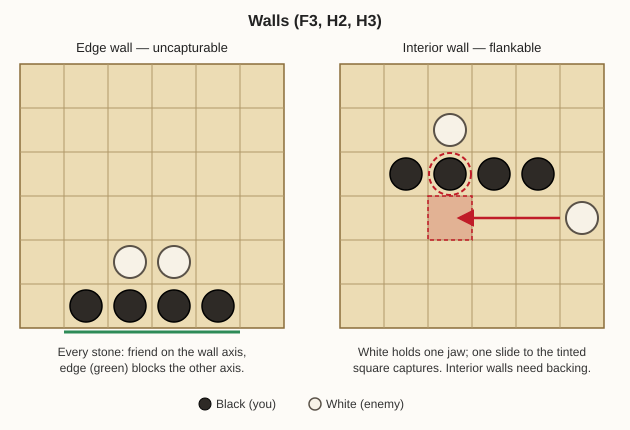
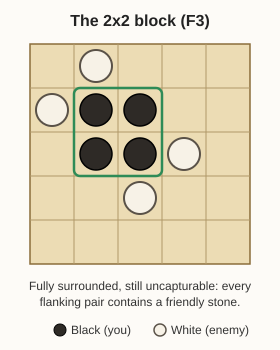
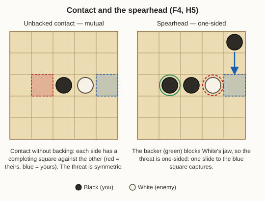
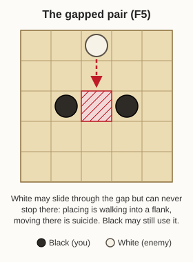
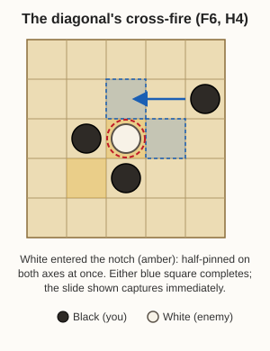
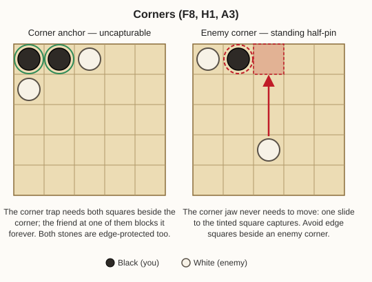
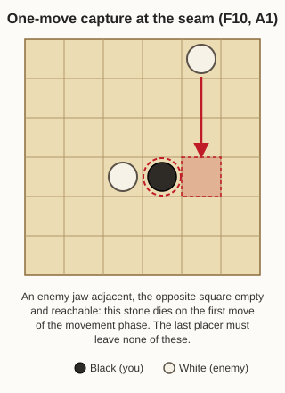

<!-- Copyright Ben Paul Wise. All Rights Reserved. -->

# Latrunculi — placement-phase analysis and heuristics

Written 2026-08-24. Analysis only; nothing here is implemented yet.

The placement phase is roughly 40 plies with no captures, no obvious material
signal for negamax, and rollouts that shuffle to stalemate, so MCTS gets no
traction either. This document derives what the rules actually imply for
placement and turns that into heuristics an engine can score. Sources: the rule
set as described in `doc/latrunculi-rules-for-beginners.md` and the code in
`latrunculi_game/` (`Game.h`, `Eval.h`, `PlacementPolicy.h`); open problems
referenced below are from `doc/2026-07-22-latrunculi-further-improvements.md`.

Known-good tactics from ancient sources and observed play, which this analysis
explains rather than assumes: horizontal/vertical walls, diagonals, the solid
2x2 square, guards near formations, corner placement, and not placing where a
stone can be pinned in one move.

## 1. Facts derived from the rules

These are the load-bearing consequences of custodial capture + the placement
restriction + rook slides. Everything else follows from them. The diagrams
referenced below live in `images/latrunculi-placement-*.svg`; in all of them,
filled discs are Black (your side) and open discs are White (the enemy). Red
tint marks a capture-completing square, blue tint marks yours, hatching marks a
denied square, a dashed red ring marks a threatened stone, and a solid green
ring marks a protected one.

**F1 — One friendly neighbour per axis is full protection on that axis.**
Capture needs enemy *free* discs on *both* opposite sides. A flanking square
occupied by anything of yours (or by an enemy *bound* disc, per `pinnedOn`) can
never be one jaw of the sandwich. So a stone is permanently safe on an axis if a
friend sits on either side of that axis.

**F2 — The board edge is a free flanker-blocker.** A stone on an edge cannot be
flanked perpendicular to the edge (one side is off-board). Only the corner
square has its own special trap rule.

**F3 — Safety economics: edge pair = 2 stones, interior square = 4.** From
F1+F2:

- Any two orthogonally adjacent stones *on an edge* are both completely
  uncapturable: each is edge-protected on one axis and friend-protected on the
  other. A full edge wall, ends included, is uncapturable.
- In the interior, a pair is safe only along its own axis; both stones stay
  flankable on the perpendicular axis. Full interior safety costs a 2x2 block
  (each stone has a friend on both axes), which is why the 2x2 cannot be
  captured.
- A corner stone plus one adjacent stone is an uncapturable pair *and*
  permanently disables the corner-trap rule on that corner.

**F4 — Attacks are mutual unless backed.** Placing adjacent to an enemy stone
half-pins it, but symmetrically half-pins your own stone on the same axis. The
threat becomes one-sided only if your attacker has a friendly backer directly
behind it on the attack axis (`X X E .`): then your stone is safe on that axis
and the enemy is not. Call this the **spearhead**. It is exactly the
pair-pointed-at-an-enemy that the improvements doc (section 2.1) says the
`pairs` term should count.

**F5 — A gapped pair controls its gap forever.** With `X . X`, the enemy can
neither *place* in the gap (placement forbids walking into a flank) nor *move*
into it (no-suicide), as long as both flankers stay free. You can still use the
square yourself. This is space denial at two stones per square, and it channels
where enemy slides can land — though slides still pass *through* the gap.

**F6 — The diagonal is cross-fire plus counterattack.** Diagonal stones at
`(r,c)` and `(r+1,c+1)` do not protect each other (no orthogonal adjacency),
but the two "notch" squares between them are each orthogonally adjacent to both
stones *on different axes*. An enemy entering a notch is instantly half-pinned
twice, and you already hold one jaw of a flank against it — one slide completes
the capture. Attacking either diagonal stone puts the attacker in a notch.
Diagonal stones also never block each other's slides, so they keep full
mobility. This is why the observed diagonal play works.

**F7 — Enemy diagonals create poison squares for you.** The mirror of F6: a
square adjacent to two enemy stones on different axes is half-pinned on two axes
at once; covering both completing squares costs two tempi. Never place there.

**F8 — An enemy-held corner permanently half-pins your edge neighbours.** Your
stone at `(0,1)` next to an enemy corner `(0,0)` is half-flanked by a stone that
never needs to move. One enemy slide to `(0,2)` captures. Symmetrically, taking
a corner adjacent to enemy edge stones is a standing threat that costs nothing
to maintain.

**F9 — Captures require a mover; walls cannot strike.** The trap springs only
as the result of a move, so every capture needs a free stone with a clear slide
ray to the completing square. An army that is 100% wall/block has zero attack.
The pacific rule + komi punishes that: two inert blobs -> quiet game -> material
count -> komi 1.5 decides. Player 0 in particular can never afford the pure
turtle.

**F10 — The phase seam has fixed parity.** With equal `perSide`, player 1
places last and player 0 moves first. So player 1's final position must contain
*zero* one-move captures against it (player 0 strikes immediately); player 0
can tolerate at most a threat it can answer with its first move. The last few
placements are tactics, not development.

**F11 — Interior blob cores are dead weight and an immobilization risk.**
Fully enclosed stones have no moves and can reach no completing square. The
"two large uncapturable blobs" failure recorded in the improvements doc is F3
taken to its limit while ignoring F9.

## 2. Heuristics to build (things to do)

**H1 — Claim edge-pair anchors early, corners first when contested.** A corner
plus one edge neighbour (F3) is the cheapest permanent material. On small
boards (6x6) two such anchors on adjacent edges nearly frame the board; on
10x12 pick the edges facing the enemy's weight.

**H2 — Build edge walls, but only where they project power.** An edge wall is
safe (F3) but inert (F9). A wall segment is worth building where its stones
have open perpendicular rays *into* the contested area — the wall doubles as a
rank of guards, each one slide away from the front. A wall facing away from the
enemy is stored material that komi can beat.

**H3 — Interior structure is either 2x2, doubled, or gapped.** A
single-thickness interior wall is uniformly flankable on the perpendicular axis
(F3). Acceptable interior shapes: the 2x2 block (full safety, use sparingly per
F11), a wall backed by a second partial row, or the gapped wall `X . X . X` —
half the stones per unit length, every gap denied to the enemy (F5), every
stone still mobile. The gapped wall blocks *occupation* of a line, the solid
wall blocks *transit*; choose by purpose.

**H4 — Extend diagonals toward the enemy.** Bonus for placing diagonal to an
own stone with both notch squares empty (F6), scaled up when the diagonal
points at the enemy mass. Diagonals are the offensive complement to walls:
mutual cover, no self-blocking, and they convert to pairs or flanks in one
slide.

**H5 — Attack only as a spearhead.** Place adjacent to an enemy stone only when
the square directly behind on that axis is already yours or is your planned
next placement (F4). Prefer targets with restricted escape: enemy stones on
edges, next to your corner (F8), or already in your diagonal's cross-fire.

**H6 — Keep strikers.** Maintain a minimum of free stones (roughly 3-5, scaling
with board size) outside any structure, each with at least two long open rays
toward the contested zone. These are the movers F9 requires. A concrete measure
already exists: Eval's `threats` counts exactly "half-pins whose completing
square one of my strikers can reach"; placement should maximize the *potential*
for that term entering movement.

**H7 — Guard your own completing squares.** For each of your stones the enemy
has half-pinned, the completing square is a hot square: either occupy it (which
usually forms a pair — defense and structure in one stone) or keep a clear ray
to it so the enemy completing move can itself be met. Defensive mirror of
`threats`.

**H8 — Ramp aggression over the phase.** Roughly: first ~25% of placements
claim (anchors, spacing, key lines — the current `PlacementPolicy`
interior-seed preference already does the spacing half); middle ~50% build
(H2-H5, denial, guards); last ~25% play the seam (F10): as player 1, treat "no
one-move capture against me" as a hard constraint; as player 0, spend the last
placements creating threats the opponent's single first move cannot fully
answer.

## 3. Heuristics to avoid (penalties)

**A1 — Never end up one-move-capturable.** The key predicate, computable from
existing machinery: *stone S is one-move-capturable iff an enemy free disc is
orthogonally adjacent on some axis, the opposite square is empty and on-board,
and some enemy free disc has a clear slide ray to it* (this is `canOccupy` with
colors swapped). Weight the penalty by placement progress: mild early (the
enemy must still spend placements to exploit it), prohibitive in the last few
plies (F10).

**A2 — Do not place in an enemy notch** (F7); more generally, penalize each
half-pin a candidate square walks into, doubled when two axes are hit at once.

**A3 — Do not take edge squares adjacent to an enemy corner** (F8), or more
generally edge squares where the enemy already holds one edge-axis neighbour.

**A4 — Do not over-clump.** Penalize placements that fully enclose an own stone
(zero empty orthogonal neighbours and no open ray), and cap the fraction of the
army in complete-safety structures — the rest of the safety budget buys nothing
and costs strikers (F9, F11). This is the quadratic-pairs pathology of
improvements-doc section 2.1, applied at placement time.

**A5 — Do not block your own guards.** A placement that closes the last open
ray between a striker and the hot squares it covers converts a guard into wall
filler. Cheap check: does the candidate square lie on the only clear ray from a
friendly striker to a currently-guarded square.

**A6 — Do not push a lone stone chain toward the enemy.** Unbacked advanced
stones are standing targets the opponent attacks for free, with placements that
simultaneously develop their own structure (F4 in reverse).

## 4. Scaling 6x6 to 10x12

The patterns are size-free; only weights and budgets scale.

- **Density** (`2*perSide / (rows*columns)`, 50% at the 8x10 default) is the
  main dial. Higher density -> space runs out -> walls, gapped denial, and the
  immobilization risk (A4) gain weight. Lower density -> open rays everywhere ->
  one-move-capturability (A1) and striker count (H6) gain weight.
- **Absolute budgets scale with perimeter and army size**: anchors ~ one per
  contested edge; strikers ~ `perSide/5` with a floor of 3; structures sized so
  the safe fraction of the army stays around 40-60%, lower on big open boards.
- **Distances need no tuning**: slide reachability is computed, not estimated,
  so guard coverage and threat reach adapt to board size automatically.
- On 6x6 the corner/edge terms dominate (about a third of the squares touch an
  edge); on 10x12 wall orientation toward the center (H2) and diagonal
  direction (H4) matter more because there is real interior to fight over.

## 5. Implementation sketch (future work, not started)

Nearly all terms are functions of board shape only, in the spirit of
`Eval.cpp`:

1. **Placement move ordering** — improvements doc section 3.1 already flags
   that `moveOrderScore` returns 0 during placement. A weighted sum of the
   terms above per candidate square fixes that directly, and top-K pruning
   (K ~ 15-20 of the up-to-~140 empty squares) would let iterative deepening
   reach real depth in the opening.
2. **New Eval features**, each a pure `(cells, rows, columns, player)` function
   like the existing terms:
   - per-stone vulnerable-axes count (F1-F3);
   - one-move-capturable flag (A1; reuses the `canOccupy` ray walk with colors
     swapped);
   - diagonal-support count (F6);
   - denied-square count (F5);
   - spearhead pairs (F4 — this IS the section 2.1 "restrict" fix);
   - striker count (H6).
3. **Phase schedule** (H8, A1 ramp) needs only `placed_[player] / perSide` as
   the progress input.
4. **`PlacementPolicy` stays as is** — its random seeds provide variety; the
   heuristics govern the *searched* runs between them, which is exactly the
   division of labor its header describes.

Two system-level notes for when this is tuned:

- The heuristics deliberately push both sides toward contact (spearheads,
  diagonals, seam threats). That is also the medicine for the MCTS stalemate
  problem: rollouts from a placement that ends with live tension terminate
  decisively far more often than rollouts from two blobs.
- The turtle equilibrium (F9) is what every weight choice must keep
  unprofitable. The existing `latrunculi_bench` quiet-game share is the right
  metric to watch.

<!-- Copyright Ben Paul Wise. All Rights Reserved. -->
